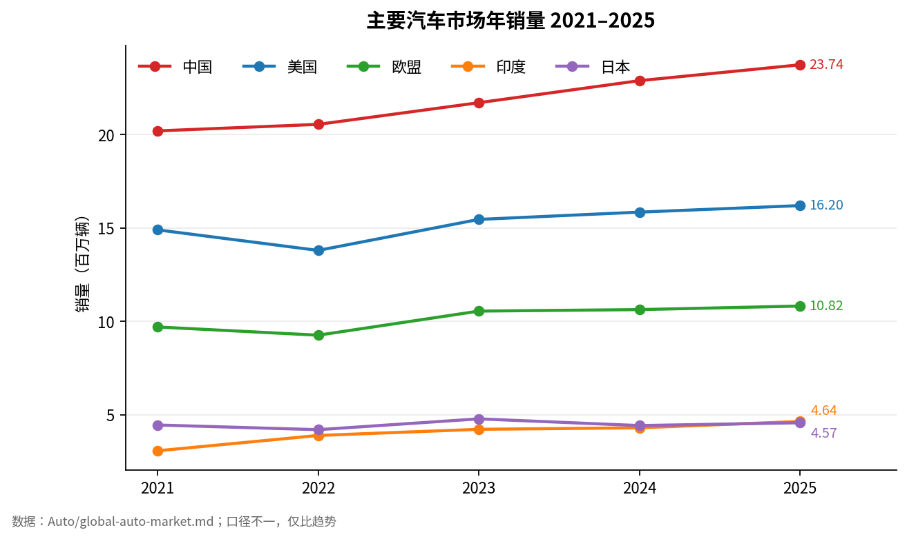
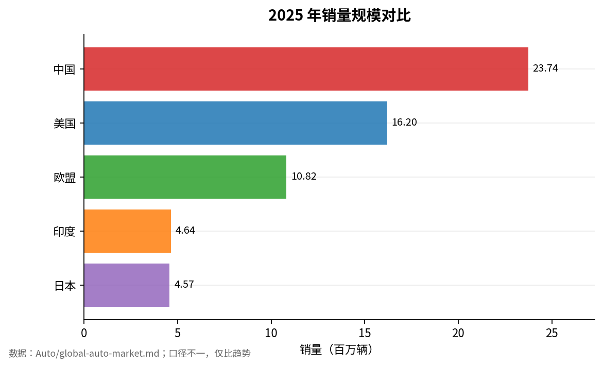
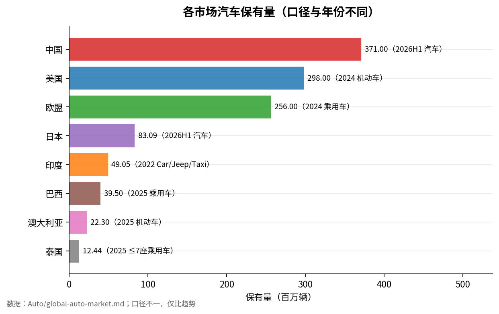
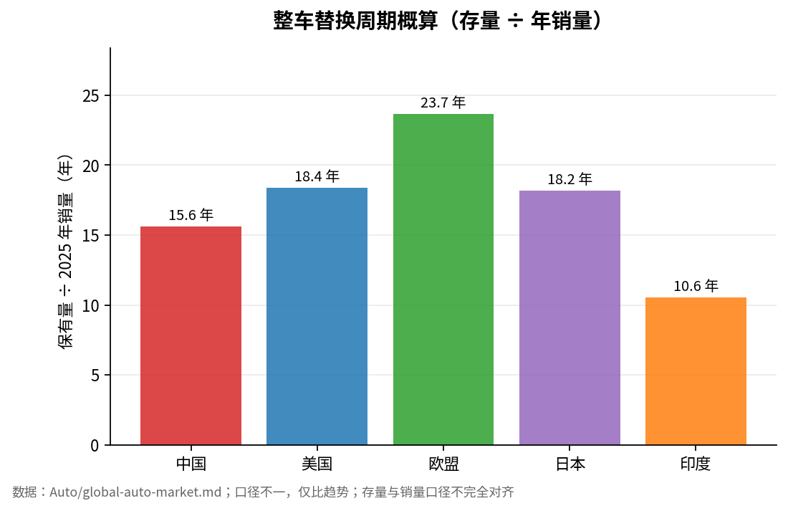

# 全球汽车市场：销量与保有量

对应原稿第 10–11 项。

## 10. 全球主要汽车市场：近 5 年总销量

单位：百万辆。**口径不同，适合看市场规模和趋势，不适合小数点级横向比较。**

| 市场 | 2021 | 2022 | 2023 | 2024 | 2025 | 口径 | 核实 |
| --- | ---: | ---: | ---: | ---: | ---: | --- | --- |
| 中国 | ~20.2 | 20.55 | 21.71 | 22.89 | 23.74 | 国内狭义乘用车零售 | ✅（2023–25） |
| 美国 | ~14.9 | 13.8 | 15.46 | 15.85 | 16.2 | 轻型汽车 | ✅（2025） |
| 欧盟 | 9.70 | 9.26 | 10.55 | 10.63 | ~10.82 | 新乘用车注册 | ✅（2025 推算） |
| 印度* | 3.07 | 3.89 | 4.22 | 4.30 | 4.64 | 乘用车，财年 | ✅（FY25/26） |
| 日本 | 4.45 | 4.20 | 4.78 | 4.42 | 4.57 | 新注册汽车 | ✅（2025） |

\* 印度对应 FY2021/22–FY2025/26。2025（FY25/26）为 464 万辆，同比 +7.9%（SIAM）。
日本 2025 为 4,565,777 辆，同比 +3.3%（JAMA/自贩连口径）。

**引用更正**：原稿此处将印度、日本与美国一并引 NADA；NADA 原文只覆盖美国，印度应引 SIAM，日本应引 JAMA。

> 美国 + 欧盟 + 印度 + 日本 ≈ **3,623 万辆/年**。全球并不存在「中国之外没有足够汽车需求」的问题。

## 11. 各市场汽车保有量

| 市场 | 保有量约 | 数据年份/口径 | 核实 |
| --- | ---: | --- | --- |
| 中国 | 3.71 亿 | 2026H1，汽车 | ✅ |
| 美国 | 2.98 亿 | 2024，所有注册机动车 | ✅ |
| 欧盟 | 2.56 亿 | 2024，乘用车 | ✅ |
| 日本 | 8,309 万 | 2026H1，全部汽车（83,086,808 台） | ✅ |
| 印度 | 4,905 万 | 2022，Car/Jeep/Taxi | ❓ |
| 巴西 | 约 3,950 万 | 2025，实际流通乘用车 | ✅（Automóveis 口径） |
| 澳洲 | 2,230 万 | 2025，机动车 | ❓ |
| 泰国 | 1,244 万 | 2025，≤7 座私人乘用车 | ❓ |
| 泰国皮卡 | 约 700 万 | 另外计算 | ❓ |

关键结构：
- 中国 2026-06 汽车保有量 3.71 亿，其中新能源汽车 4,897 万辆，**仅占 13.19%**。新车新能源渗透已过半，存量替换远未完成。
- 欧盟道路 2.56 亿辆乘用车中，可外接充电存量占比只有 **3.7%**。

> 欧洲长期空间：2.56 亿存量 × 3.7% 插电化存量。

（图表由 `plot_global_auto_market.py` 生成，重跑脚本即可更新。）

## 来源

- 中国乘用车（汽车之家研究院/乘联分会）：https://www.jtcopper.com/wp-content/uploads/2026/02/2025%E5%B9%B4%E4%B9%98%E7%94%A8%E8%BD%A6%E5%B8%82%E5%9C%BA%E6%80%BB%E7%BB%93%E5%8F%8A%E5%B1%95%E6%9C%9B.pdf
- 美国：https://www.nada.org/nada/nada-headlines/december-2025-market-beat-new-light-vehicle-sales-totaled-162-million-units
- 欧盟：https://www.acea.auto/pc-registrations/new-car-registrations-1-8-in-2025-battery-electric-17-4-market-share/
- 中国保有量：https://english.www.gov.cn/archive/statistics/202607/15/content_WS6a56dd6ec6d00ca5f9a0c307.html
- 美国保有量：https://www.fhwa.dot.gov/policyinformation/pubs/our_nations_highways_2026/vehicles.cfm
- 欧盟保有量：https://www.acea.auto/publication/report-vehicles-on-european-roads-2026/
- 日本保有量（AIRIA）：https://www.airia.or.jp/publish/statistics/number.html
- 印度销量（SIAM 口径）：https://www.fortuneindia.com/auto/passenger-vehicle-sales-hit-record-464-million-units-in-fy26-suvs-power-growth-as-q4-volumes-rise-13-siam/132401
- 日本销量：https://www.nippon.com/en/japan-data/h02659/
- 巴西保有量（SINDIPEÇAS）：https://virapagina.com.br/sindipecas2025/49/
